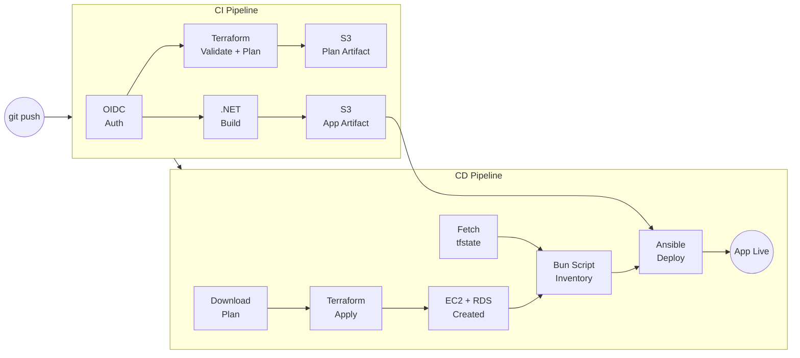

# Devops



Automated infra and config with deployment setup using Terraform for Infra provisioning, Ansible for configuration and deployment and Github actions as the automated runner for these two pipelines
    
## Terraform local setup
> Before starting make sure to install and configure aws cli and terraform locally

Clone the project

```bash
  git clone https://github.com/codesbyayush/terra-ansi-cs
```

Go to the project directory

```bash
  cd terra-ansi-cs
```

Initialize terraform

```bash
  cd terraform-01
  terraform init
```
> Before running apply we need to create a s3 backend store for the build file
> `terraform apply --target=module.s3_build_files`
Provision infra

```bash
  terraform apply -auto-approve
```

## Deploy 

- Read this [blog](https://aws.amazon.com/blogs/security/use-iam-roles-to-connect-github-actions-to-actions-in-aws/) before moving forward for initial setup 

- Setup the OpenId connect identity provider for github actions to automate infra on aws, attach a new role to this and copy the arn we will need it in envs.

- Add these required env variables in the github repository secrets to be used in action workflow, 

- Env required:
  > `AWS_GH_ACTION_ROLE_ARN` : Role we created earlier for github to assume
  > `AWS_BACKEND_BUCKET` : State bucket for storing terraform state
  > `AWS_SSH_KEY_NAME` : Aws key-pair used in login or sshing into the machine
  > `DB_NAME` : Name of the database we are creating using rds module
